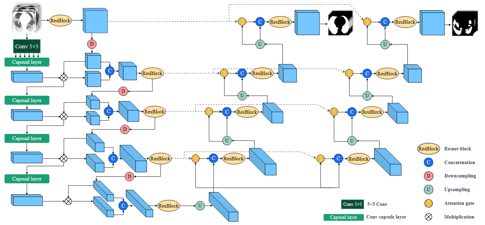

# CAD-Unet: A Capsule Network-Enhanced Unet Architecture for Accurate Segmentation of COVID-19 Lung Infections from CT Images

contributions：

- We introduce a dedicated network architecture designed to address the segmentation task of COVID-19 pulmonary CT lesions, with a particular focus on handling complex lesion shapes that are difficult to identify. This architecture integrates both capsule networks and U-Net, enhancing the model's capability to capture and encode critical information in lung CT images.
- We innovatively design the integration of capsule networks pathway and U-Net encoder pathway in parallel, coupled through a pathway coupling mechanism. This design not only maximizes the complementary strengths of the two network structures but also allows for efficient information fusion. The model learns and expresses features more comprehensively, excelling particularly in scenarios involving complex lesion shapes and ambiguous boundaries.



## Environment 

### Software Dependencies
- Python: 3.7.12
- PyTorch: 1.13.0
- NumPy: 1.21.6
- OpenCV: 4.7.0
- MONAI: 1.1.0

### Installation Steps
You can use `pip` or `conda` to install the required dependencies. Here is an example using `pip`:
```bash
pip install  numpy==1.21.6 opencv-python==4.7.0 MONAI=1.1.0 ...
```

### Data Preparation

#### Dataset Download
You can download Dataset 1 and Dataset 2 from http://medicalsegmentation.com/covid19/. For the other datasets, please refer to the cited references.

#### Data Preprocessing
For the binary segmentation task, run the `prepare_dataset_BinarySegmentation.py` script to process the data.
For the multi - class segmentation task, run the `prepare_dataset_MultiClassesSegmentation.py` script to process the data.
The processed dataset includes a `.pt` file for the training set and a `.pt` file for the validation set.

### Model Training
For the binary segmentation task, execute the train_test_DTrAttUnet_BinarySegmentation.py script to start model training. For the multi - class segmentation task, execute the train_test_DTrAttUnet_MultiClassesSegmentation.py script to start model training. Set the following parameters within these files:
- root_path: The root directory of the dataset.
- train_dataset_name: The file name of the training dataset.
- valid_dataset_name: The file name of the validation dataset.

